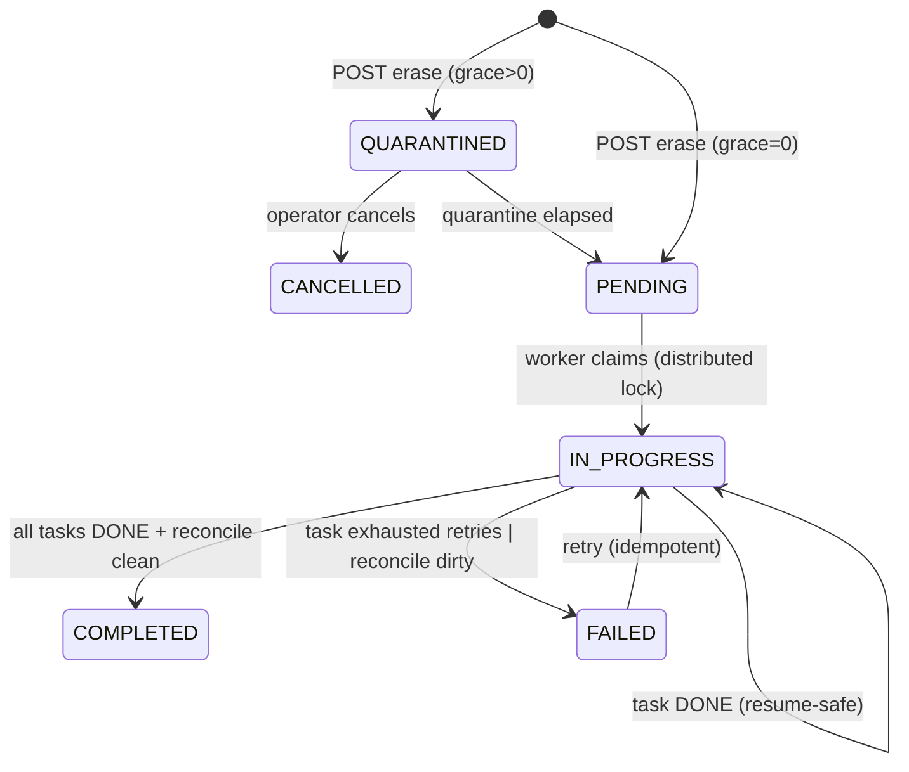
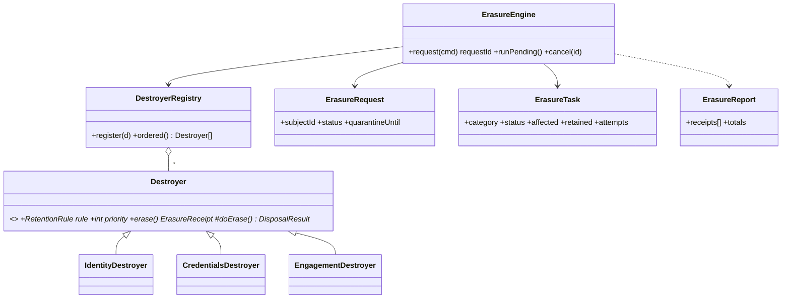

# Design v2: Personal-data erasure — request-driven Destroyer engine

- Status: Draft (for review) — v2, incorporates the staff design review
- Date: 2026-07-18
- Related: ADR-0004 (transactional outbox), ADR-0006 (MongoDB + PII),
  ADR-0008 (two-tier logging & audit), ADR-0002 (rich domain model),
  ADR-0010 (OpenTelemetry)

## 0. What changed from v1 (review deltas)

| # | v1 problem (review) | v2 resolution | § |
|---|---|---|---|
| 🔴1 | Single `@Transactional` fan-out over 22 collections → blows Mongo's 60s/16MB tx limit; nested tx under batch | **Request/state-machine**: per-category **idempotent, resumable tasks**, each in its own **bounded** tx. ACID-everything goal dropped. | 5 |
| 🔴2 | PII already published to Kafka (`recipientUserId`, `access_log.userId`); primary-only erase is incomplete | **Downstream erasure contract**: emit `SUBJECT_ERASED` via the outbox; boundary made explicit | 7 |
| 🔴3 | Hand-rolled Spring Batch clone = over-engineering for 2–3 jobs | Deleted. **Native Mongo TTL + one thin cursor cron**; progress lives in **domain state** (tasks), not generic batch metadata | 5, 9 |
| 🟡4 | `isRunning` in-process guard races across replicas | **Distributed-lock seam** (Redis); documented single-instance fallback | 9 |
| 🟡5 | "Provable" erasure was self-reported, unverified | **Reconciliation scan**: residual-PII assertion before COMPLETED | 8 |
| 🟡6 | Immediate irreversible anonymize by one operator | **Quarantine + cancel window**; optional approval-engine routing | 11 |
| 🟡7 | Export dumps decrypted PII into the response → access-log leak | Export response **excluded from access logging** | 11 |
| 🟡8 | No erasure-SLA observability (PIPA 5-day clock) | **OTel metrics** on pending-age + task failures | 10 |
| 🟢 | Nondeterministic destroyer order; category 1:1; tombstone read-after-erase; `countRetained` extra query | `priority` ordering; per-`(module,category)`; erased-marker read path; fold retained into `doErase` return | 6 |

## 1. Problem

A member can demand access to and erasure of their personal data, which is
smeared across **22 collections** plus data that has **already left the service**
(the outbox published `recipientUserId` to Kafka; `access_log.userId` went to
`hobom.logs`). Some data must be **retained** (the audit trail proves the erasure;
the adopter-safety signal is a legitimate interest). And data that has simply
outlived its purpose must be destroyed on schedule — PIPA Art.21: "without undue
delay", within 5 days of the retention window ending.

Erasure therefore is **not** one atomic delete. It is a **long-running, verifiable,
resumable process** with three triggers sharing one per-category disposition
logic: on-demand (DSAR), scheduled auto-purge (withdrawal grace), and time-based
retention sweeps.

## 2. Goals / non-goals

**Goals**
- One audited, operator-only surface: export + erase.
- Disposition + retention windows **encoded as data**, enforced by code.
- **Idempotent & resumable**: any step can be safely re-run; a crash resumes from
  the first incomplete category.
- **Bounded work units**: no unbounded multi-collection transaction.
- **Provable**: `ErasureReport` + `DELETE_PII` audit + a **reconciliation scan**.
- **Downstream-aware**: emit an erasure event for data already published.
- **Extensible**: a new domain adds a `Destroyer`; engine/scheduler unchanged.
- **Observable**: erasure-SLA metrics on the OTel pipeline (ADR-0010).

**Non-goals (first cut)**
- Full cross-domain export dump (export returns identity/profile PII first).
- Fine-grained resume *within* a single category (a category re-runs whole; it is
  idempotent, so that is safe — just not minimal).

## 3. Retention schedule (confirmed 2026-07-18)

Dispositions: **HARD_DELETE** (remove row), **ANONYMIZE** (sever user link + strip
free-text PII, keep row), **RETAIN** (legal basis — keep), **PURGE_WINDOW** (delete
after a TTL, mostly native Mongo indexes).

| Category / collection | Disposition | Window | Driver | Basis |
|---|---|---|---|---|
| DSAR erase request | ANONYMIZE | quarantine → execute | engine | right to erasure |
| `users` (identity) | ANONYMIZE | on execute | engine | identity tombstone |
| self-withdrawal → auto-purge | ANONYMIZE | **30d** grace | cron → engine | recovery window |
| `refresh_tokens` | HARD_DELETE | on execute / native TTL | engine + TTL | security |
| likes / bookmarks / favorites | HARD_DELETE | on execute | engine | pure preference |
| `outbox` SENT / FAILED | PURGE_WINDOW | **7d / 30d** | **native TTL** | delivery done / debug |
| `idempotency_keys` | PURGE_WINDOW | **24h** | **native TTL** (exists) | dedup window |
| `erasure_requests` metadata | PURGE_WINDOW | **90d** | native TTL | ops evidence retention |
| application questionnaire | ANONYMIZE (purge) | on execute | engine | sensitive PII |
| application decision + dates | RETAIN → purge | **5y** ⚠ | cron | adoption legal record |
| `audit_logs` | RETAIN → purge | **3y** ⚠ | cron | access-record duty; erasure proof |
| adopter-history safety flag | RETAIN (pseudonymized) | **3y** ⚠ | cron | animal-welfare interest |
| messages/reviews/posts/comments/signups/reports/approvals | ANONYMIZE | on execute | engine | integrity |
| `announcements`/`faqs` | ANONYMIZE author only | on execute | engine | org content |
| `shelters.staffIds[]` | remove link | on execute | engine | membership |

⚠ 5y / 3y pending legal; all windows live in one `RetentionPolicy` constant.

## 4. The `Destroyer` abstract class (Template Method)

One per **(module, category)**. `erase()` is the fixed template; subclasses fill
only the disposition. `doErase` returns **both** counts (no extra `countRetained`
query), must be **idempotent** (re-running on an already-anonymized subject
returns `affected: 0`), and declares a **priority** for deterministic ordering.

```ts
// src/shared/erasure/destroyer.abstract.ts
export interface DisposalResult { affected: number; retained: number; note?: string; }

export abstract class Destroyer {
  public abstract readonly rule: RetentionRule;
  /** Lower runs first; identity last so content that references it goes first. */
  public abstract readonly priority: number;

  /** Template method — FINAL. */
  public async erase(subjectId: UserId, ctx: ErasureContext): Promise<ErasureReceipt> {
    const { affected, retained, note } = await this.doErase(subjectId, ctx);
    return ErasureReceipt.of({
      category: this.rule.category, disposition: this.rule.disposition,
      affected, retained, note,
    });
  }

  /** Apply disposition for this subject. MUST be idempotent. */
  protected abstract doErase(subjectId: UserId, ctx: ErasureContext): Promise<DisposalResult>;
}
```

`ErasureContext` carries `{ session, actorId, reason }`. `session` is the **current
task's** bounded transaction — a destroyer never spans more than its own category.

Supporting: `DataCategory`, `Disposition`, `RetentionRule{category,disposition,
legalBasis,retentionDays?}`, `ErasureReceipt`, `ErasureReport`.

## 5. Execution model — request + resumable task machine (core)

Erasure is a **request** that progresses through per-category **tasks**, not a
synchronous fan-out.

**Collections**
- `erasure_requests` — `{ subjectId, actorId, reason, status, quarantineUntil,
  requestedAt, completedAt }`. Status: `QUARANTINED → PENDING → IN_PROGRESS →
  COMPLETED | FAILED | CANCELLED`.
- `erasure_tasks` — one row per registered destroyer per request:
  `{ requestId, subjectId, category, priority, status, affected, retained,
  attempts, lastError }`. Status: `PENDING → DONE | FAILED`.

**Lifecycle**
1. **Request** (`POST …/erase`) → create request `QUARANTINED` (or `PENDING` if
   grace = 0) + fan out `erasure_tasks` (one per destroyer). Audit `DELETE_PII`
   *intent*. Return **202** with `requestId`. *(No synchronous nuke.)*
2. **Quarantine** — operator may `CANCEL` while `QUARANTINED`; after
   `quarantineUntil`, the worker flips it `PENDING`.
3. **Execute** (worker) — for each task in **priority order**, run
   `Destroyer.doErase` in **its own bounded transaction**; on success mark task
   `DONE` with counts; on error mark `FAILED` + increment `attempts`. Idempotent:
   a re-run skips `DONE` tasks and retries `FAILED`/`PENDING`. **No 22-collection
   mega-transaction** — the unit of atomicity is one category.
4. **Propagate** — when all in-DB tasks are `DONE`, emit `SUBJECT_ERASED` via the
   **transactional outbox** (§7) for data already downstream.
5. **Reconcile** — run the residual-PII scan (§8). Clean → request `COMPLETED`,
   persist final `ErasureReport`. Dirty → `FAILED` + alert.



Why a state machine instead of a batch metadata table: **progress is domain state**
(which categories are erased for whom), not generic job bookkeeping. It gives
resumability, cancelability, audit, and SLA metrics for free — and it is the same
model whether triggered by DSAR, the withdrawal cron, or a retry.

## 6. Registry + Engine

`DestroyerRegistry` collects every `Destroyer` (self-registration, like
`ApprovalCallbackRegistry`), sorted by `priority`. The **`ErasureEngine`** owns the
lifecycle; it is invoked identically by the DSAR controller and the withdrawal
cron.

```ts
@Injectable()
export class ErasureEngine {
  // request(): create request + tasks, audit intent, return requestId
  // runPending(): claim a PENDING request under a distributed lock, execute its
  //   tasks (each @Transactional, idempotent), propagate, reconcile, finalize
  // cancel(requestId): only while QUARANTINED
}
```



```mermaid
sequenceDiagram
  actor Operator
  participant C as DsarController
  participant E as ErasureEngine
  participant W as ErasureWorker(@Cron+lock)
  participant D as Destroyer(each, by priority)
  participant O as Outbox
  participant R as Reconciler
  Operator->>C: POST /admin/dsar/:id/erase
  C->>E: request({actor,subject,reason})
  E->>E: create QUARANTINED request + tasks; audit DELETE_PII intent
  E-->>C: 202 {requestId}
  Note over W: later — worker tick
  W->>E: runPending()
  E->>E: claim request (distributed lock) → IN_PROGRESS
  loop each task (priority order), own tx
    E->>D: doErase(subject, ctx)
    D-->>E: {affected, retained}  %% idempotent
  end
  E->>O: emit SUBJECT_ERASED (transactional outbox)
  E->>R: reconcile(subject)
  R-->>E: clean
  E->>E: COMPLETED + persist ErasureReport
```

## 7. Downstream erasure contract (🔴2)

Angel is authoritative for its own stores; it is **not** authoritative for data it
already published. On COMPLETED, the engine emits a new outbox event:

```
EventType.SUBJECT_ERASED  payload: { subjectUserId, erasedAt }
```

- Rides the existing transactional outbox → `hobom-event-processor` → Kafka, same
  path as every other event (ADR-0004). **Cross-repo coordination required**: the
  processor must route `SUBJECT_ERASED` to a topic downstream consumers honor
  (they purge their own `userId`-keyed copies, incl. the `hobom.logs` sink).
- Angel's boundary is stated explicitly in the ADR: **angel purges its collections
  and *requests* downstream erasure; it cannot guarantee third-party deletion.**
  That honesty is the correct compliance posture — the alternative (pretend
  primary-only erase is complete) is the actual violation.

## 8. Reconciliation (🟡5)

Before a request goes `COMPLETED`, a `Reconciler` scans every erasure-owned
collection for the `subjectId` and asserts **zero residual identifiable PII**
(FK links severed / anonymized). A non-empty result → `FAILED` + alert; never a
silent success. The scan is the *proof* behind `ErasureReport`, not each
destroyer's self-report.

## 9. Scheduling & concurrency (🔴3, 🟡4)

**No Spring Batch clone.** Three simple mechanisms:

1. **Native Mongo TTL indexes** — `outbox` SENT (7d) / FAILED (30d) via a partial
   TTL index; `idempotency_keys` (24h, exists); `erasure_requests` (90d). Zero
   code, zero jobs.
2. **`ErasureWorker`** — one `@Cron` (KST, mirrors `volunteer-expiry.schedule.ts`)
   that (a) flips quarantine-elapsed requests to `PENDING`, (b) claims and drains
   `PENDING` requests via the engine. Cursor-paginated; bounded per tick.
3. **Retention sweeps** — thin `@Cron` jobs for legal windows (applications >5y,
   audit >3y, adopter-history re-eval) — cursor scans, no framework.

**Concurrency**: the worker claims a request under a **distributed lock**
(`LockPort`, Redis impl when Redis lands; until then a documented single-writer
assumption + a Mongo `findOneAndUpdate` status CAS as the interim guard). A real
`Job` abstraction is extracted only when a 3rd distinct job appears (YAGNI).

## 10. Observability & SLA (🟡8)

Wire to the OTel pipeline (ADR-0010):
- `erasure.requests.pending` (gauge) and **`erasure.request.oldest_age_seconds`**
  (gauge) — the PIPA 5-day-clock watchdog; alert threshold well under 5 days.
- `erasure.tasks.failed` (counter, by category), `erasure.request.duration`.
- Worker logs carry the OTel trace id already (log↔trace correlation from ADR-0010).

## 11. Security, reversibility, leak-prevention (🟡6, 🟡7)

- **Quarantine window** — admin erase is a request, not an instant nuke;
  cancelable while `QUARANTINED`. Window configurable (`RetentionPolicy`,
  default short to honor the 5-day duty). Guards operator error/abuse.
- **Optional approval routing** — for high-value subjects, an erase request can be
  gated by the existing approval engine (two-person rule) before leaving
  `QUARANTINED`. Off by default; a config flag.
- **Export no-log** — the export endpoint's decrypted PII response is **excluded
  from the access-log interceptor** (a `@NoAccessLog` marker / skip predicate) so
  PII never reaches `hobom.logs`. Export still records `EXPORT_PII` in the audit
  trail (metadata only, no PII values).

## 12. Endpoints (operator-only)

Erasure runs in the **daily 03:00 sweep** ({@link ErasureWorker}), not from an
endpoint — the operator surface is **read-only**: data-subject access (export)
and erasure lookup. A withdrawn account (self-service `POST /users/me/withdrawal`,
which stamps a 30-day `purgeAfter`) is what the sweep acts on.

```
POST /{prefix}/admin/dsar/subjects/:userId/export     → 200 PersonalDataResponse   (audits EXPORT_PII; response not logged)
GET  /{prefix}/admin/dsar/subjects/:userId/erasures   → 200 ErasureRequestResponse[] (a subject's erasure reports)
GET  /{prefix}/admin/dsar/erasures/:requestId         → 200 ErasureRequestResponse   (one report / progress)
```

`JwtAuthGuard` + `@CurrentUser`; use-cases assert platform admin. (A cancelable
quarantine window + an operator-initiated/expedite path are deferred — erasure
today is purely policy-driven off the withdrawal grace.)

## 13. Package layout

```
src/shared/erasure/
  destroyer.abstract.ts  data-category.enum.ts  disposition.enum.ts
  retention-rule.ts  retention-policy.ts  erasure-context.ts
  erasure-receipt.ts  erasure-report.ts
  destroyer.registry.ts  erasure-engine.ts  reconciler.ts
  erasure-request.entity.ts  erasure-task.entity.ts
  erasure.worker.ts  erasure.module.ts
src/shared/lock/ lock.port.ts (+ mongo-cas / redis impl)
src/hb-backend-api/<domain>/adapters/erasure/<domain>-<category>.destroyer.ts
src/hb-backend-api/outbox/domain/enums/event-type.enum.ts   # + SUBJECT_ERASED
```

`DIToken.ErasureModule` (Engine, Registry, ReportPort, Reconciler) added to the
catalogue.

## 14. Staged delivery

- **PR1 — engine + daily worker + read surface** ✅ *(shipped)*: `Destroyer`
  abstract + registry, `ErasureEngine` (request → per-category bounded-tx tasks,
  idempotent, resumable), `Reconciler`, Identity + Credentials destroyers,
  `EXPORT_PII`/`DELETE_PII` audit, OTel metrics, the **daily 03:00 `ErasureWorker`**
  (scans withdrawn-past-grace → erases each subject), and the read-only operator
  API (export + erasure lookup). Erasure of identity + tokens runs end-to-end,
  verified + reconciled.
- **PR2 — downstream + hardening**: `SUBJECT_ERASED` outbox event + **cross-repo
  processor change**; distributed-lock seam; optional cancelable quarantine +
  operator-initiated erase.
- **PR3 — content destroyers**: applications (+questionnaire), messages, reviews,
  posts, comments, engagement, reports, announcement/faq authorship, shelter link.
- **PR4 — native TTL + retention sweeps**: outbox SENT/FAILED partial-TTL indexes,
  legal-retention crons, adopter-history pseudonymized retention.

Each PR ships green (per-layer tests + coverage gate), against `develop`.

## 15. Open questions

1. **Quarantine default** — 0d (immediate, PIPA-tight) or a short cancelable
   window (e.g. 24h)? (leaning: 24h, cancelable — reversibility beats speed within
   the 5-day budget)
2. **`SUBJECT_ERASED` topic & consumers** — which downstream services subscribe,
   and is the processor change in-scope for us to drive? (cross-repo)
3. **Approval routing** — ship the two-person-rule gate in PR1, or flag-off stub
   now and wire later?
4. **Reconciler strictness** — hard-fail on any residual, or classify
   RETAIN-exempt collections so the scan ignores lawfully-kept rows? (must exclude
   audit_logs / adopter-history)
5. **Legal windows** — 5y / 3y confirmation.
```
